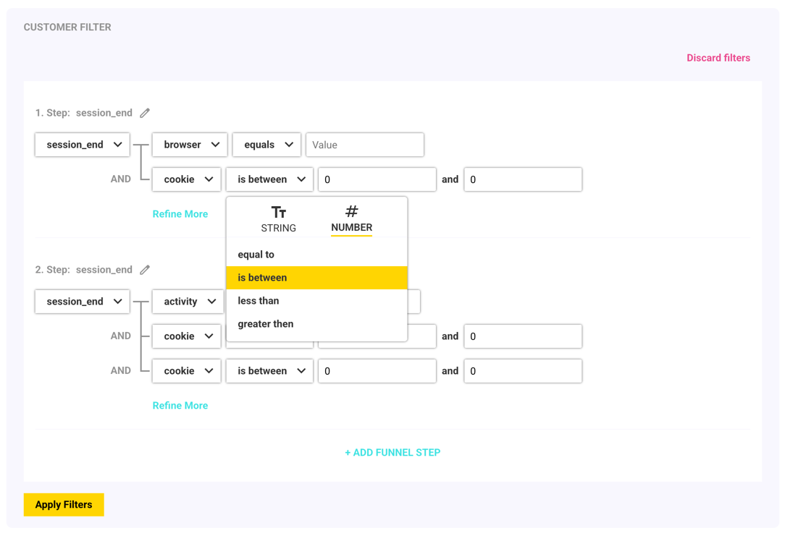

# Example of Angular Query Filter

## Project description

This project demonstrates a possible approach to dynamically building query filters in an Angular application.



This project was generated using [Angular CLI](https://github.com/angular/angular-cli) version 19.2.3.
For more details on using Angular CLI, visit the [Angular CLI Documentation](https://angular.dev/tools/cli)

## How to run the Project

### Prerequisites

- Install [Node.js](https://nodejs.org/en) which includes Node Package Manager

### Installation

To start a local development server, run:

```bash
git clone <repo-url>
cd <repo-directory>
npm install
npm start
```

Once the server is running, open your browser and navigate to `http://localhost:4200/`. The application will automatically reload whenever you modify any of the source files.

## Idea Behind

The filtering mechanism is built using **ReactiveFormsModule**, where the main **FormGroup** serves as the single source of truth.  
The entire implementation of the reusable UI pattern components is located in the `/patterns` folder.

The resulting filter value mirrors the structure of the **FormGroup**, ensuring consistency and flexibility.

### Custom Controls & External Libraries

To support the filter's design, **custom form controls** were developed for this **FormGroup**.  
For building these components, **[Angular CDK](https://material.angular.io/cdk/categories)** was used to simplify the process and provide essential utilities.  
It is important to note that this project **does not** depend on Angular Material.

### Icons

For icons, the project utilizes **[Google Icons](https://fonts.google.com/icons)**, ensuring a lightweight and consistent visual experience.


## Architecture

Below are links to detailed architecture-related topics, including dependencies, decisions, and potential improvements:

- [Architecture structure](./docs/architecture.md#architecture-structure)
  - [Folder structure](./docs/architecture.md#folder-structure)
  - [Dependencies graph](./docs/architecture.md#dependencies-graph)
- [Places for improvements](./docs/architecture.md#places-for-improvements)

## Contributing
Contributions are welcome! If you find any issues or have ideas for improvements, feel free to submit a pull request or open an issue.

### Steps to Contribute:
- Fork the repository.
- Create a new branch (git checkout -b feature-branch).
- Make your changes and commit them (git commit -m "Add new feature").
- Push to the branch (git push origin feature-branch).
- Open a pull request.
