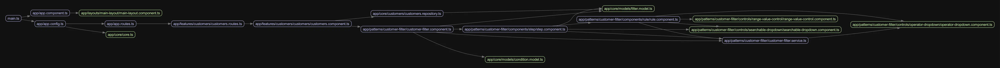

## Architecture structure

The main principles guiding the development of this project were:

#### Clean architecture

The project was designed with **Clean Architecture** in mind to ensure maintainability, scalability, and separation of concerns.
This approach was inspired by [AngularExperts.io](http://AngularExperts.io).

#### Minimum amount of 3rd party dependencies 

To minimize security vulnerabilities and simplify updates, the project prioritizes using as few third-party dependencies as possible.
This ensures long-term stability, maintainability, and easier upgrades.

### Folder structure

```plaintext
src/
├── app/                    # Main Application folder
│   ├── core/               # Core module (configuration, services, interceptors)
│   ├── features/           # Feature modules implementing business logic (lazy loaded)
│   ├── layouts/            # Layouts used thru application
│   ├── patterns/           # Reusable UI patterns and components
│   ├── ui/                 # UI components (buttons, modals, etc.)
│   ├── app.component.ts    # Main component (Only layout or router-outlet allowed)
│   ├── app.config.ts       # Application-wide configuration
│   ├── app.routes.ts       # Entry routing configuration
```

### Dependencies graph

The following dependency graph illustrates the relationships between different modules in the project.
It is based on the folder structure rules and ESLint rules (forcing these rules can be done with [eslint-plugin-boundaries](https://www.npmjs.com/package/eslint-plugin-boundaries)).



This graph was generated using [Madge](https://www.npmjs.com/package/madge), a tool for visualizing module dependencies.
To generate the graph, run the following command:

```bash
npx madge src/main.ts --ts-config tsconfig.json --image ./docs/dependencies-graph.webp
```
By analyzing dependencies with Madge, we can identify circular dependencies, improve maintainability, and ensure a clear module structure.

## Places for improvements

- Enforcing clean architecture via ESLint
- Better test coverage
- Responsiveness
- Accessibility
- Zoneless approach
- ...

